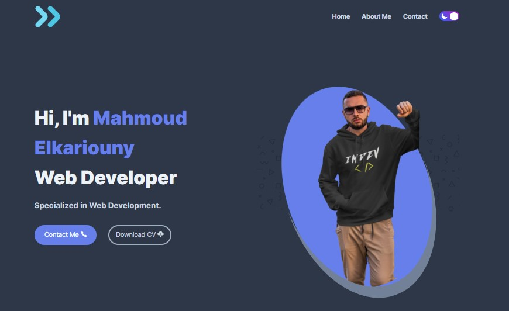
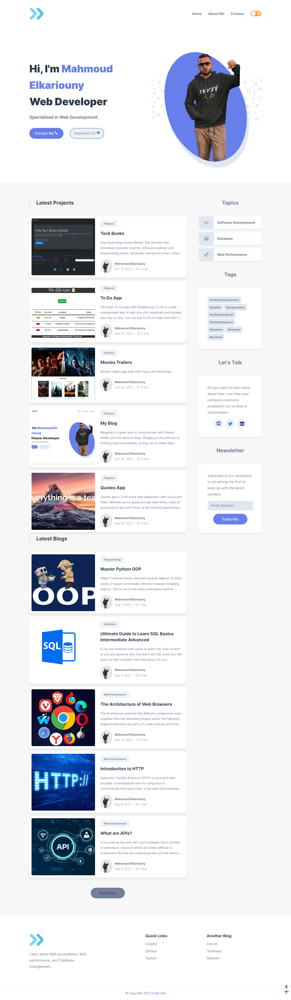

# My Blog📰 & Portfolio👨‍💻

## My portfolio introduction 🗞👨‍💻

- As a web developer, I specialize in developing beautiful, user-friendly websites.

- I have experience with a wide range of web development technologies,
  from simple HTML/CSS/JavaScript websites to more complex Vue.js

- I have been a web developer for over two years now, and I'm passionate about what I do

- I am passionate about creating high-quality websites that are not only
  aesthetically pleasing but also functional and easy to use.

- I specialize in designing and developing websites and web applications
  in Flask and Vue.js using the latest technologies.

  
  <h2 align="center">My Blog📰 & Portfolio👨‍💻</h2>

My Blog Portfolio is a fully responsive website  Responsive for all devices, build using HTML CSS JavaScript.

<a href="https://clear-sleet.surge.sh/"><strong>➥ Live</strong></a>

 

### Screeshots

### I offer the following services:

- Frontend
- Backend
- Full stack

### 🛠 My Skills

- HTML
- CSS
- JavaScript
- Vue.js
- Python
- Flask

## My Portfolio Tech Stack (Dependencies)

### Frontend Dependencies

You must have the **HTML**, **CSS**, **JavaScript** for our website.

## Tech Stack

**Client:** HTML, CSS, JavaScript

## Author

- [@mahmoudessam820](https://github.com/mahmoudessam820)

## 🔗 Links

## Feedback

If you have any feedback, please reach out to us at mahmoudelkaruony220@gmail.com 📧

## Screenshots

### Home

